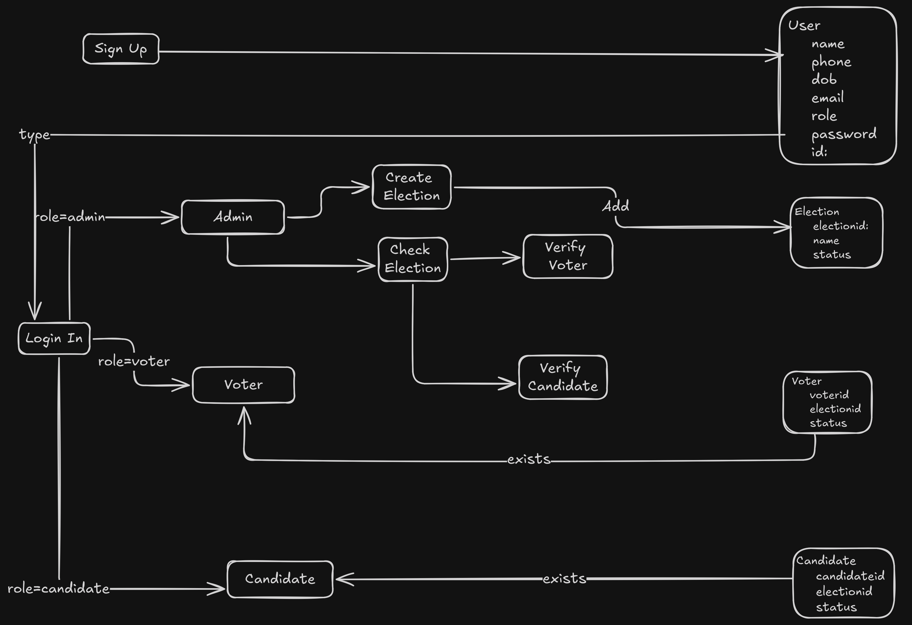

Online Voting System in Java
============================

A secure and scalable online voting platform developed using Java, JSP, Servlets, MySQL, and AJAX. This system allows users to register, authenticate, and cast votes in a simulated election environment.

🚀 Features
-----------

-   **User Registration & Login**: Voters can register and authenticate using secure login credentials.

-   **Admin Dashboard**: Admins can manage elections, view results, and oversee the voting process.

-   **Real-Time Voting**: Voters can cast their votes in real-time, with immediate feedback.

-   **Result Calculation**: Automatic tallying of votes and display of results.

-   **Responsive UI**: User-friendly interface built with HTML, CSS, and JavaScript.

🛠️ Technologies Used
---------------------

-   **Frontend**: HTML, CSS, JavaScript, AJAX

-   **Backend**: Java, JSP, Servlets

-   **Database**: MySQL

-   **Development Tools**: Eclipse IDE, Apache Tomcat

📂 Project Structure
--------------------

 [MySQL Queries](https://github.com/AnkitVS/Online-Voting-Java/blob/main/OnlineVotingJava_SQL.sql)
 
 

 ```Online-Voting-Java/
├── src/
│   └── org/
│       └── Voting/
├── WebContent/
│   ├── WEB-INF/
│   └── index.jsp
├── build/
├── .classpath
├── .project
└── README.md
```
⚙️ Setup Instructions
---------------------

1.  **Clone the Repository**:
   ```bash git clone https://github.com/AnkitVS/Online-Voting-Java.git```
2.  **Import into Eclipse**:

    -   Open Eclipse IDE.

    -   Go to `File` > `Import...` > `Existing Projects into Workspace`.

    -   Select the cloned repository folder.

3.  **Configure Database**:

    -   Set up a MySQL database named `online_voting`.

    -   Import the SQL schema from `OnlineVotingJava_SQL.sql`.

4.  **Run the Application**:

    -   Right-click on the project in Eclipse.

    -   Select `Run As` > `Run on Server`.

---

👤 Author
---------

**AnkitVS** -- [GitHub Profile](https://github.com/AnkitVS)
